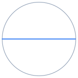
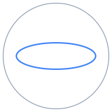
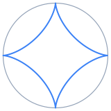
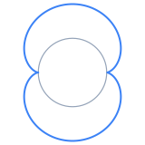
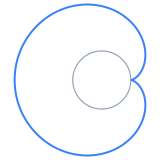
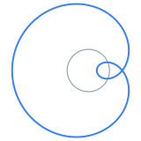
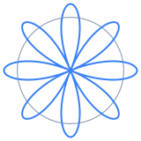

<!--
Copyright (c) 2026 Apurva Nakade. All rights reserved.
Released under Apache 2.0 license as described in the file LICENSE.
Authors: Apurva Nakade
-->


```{ojs}
//| output: false
// VM is the shared utility library, loaded globally by the mathviz extension. This page uses VM.expressions.makeNumber, VM.plotting.*, VM.ui.legendOverlay, VM.ui.applyExampleParams.
VM = window.VM
```

```{ojs}
//| output: false
// Always-live controls (max, mode, t) read their initial value from the URL
// here; the commit-gated R/r/d fields read theirs inline below.
urlParams = new URLSearchParams(window.location.search)

initialMax = urlParams.get("max") ?? "30"

initialMode = {
  if (urlParams.get("mode") === "outside") return "outside"
  return "inside"
}

initialTurns = {
  const value = Number(urlParams.get("t"))
  if (urlParams.get("t") === null || !Number.isFinite(value)) return null
  return value
}
```

```{ojs}
//| output: false
traceOptions = ["Fixed circle", "Rolling circle", "Traced path"]

// vmTheme re-runs everything that bakes a theme color into a trace; see
// apps/newton-method/index.qmd for the full explanation.
vmTheme = Generators.observe(notify => VM.plotting.onThemeChange(notify))

chartColors = VM.plotting.colors(vmTheme)

traceColors = new Map([
  ["Fixed circle", chartColors.muted],
  ["Rolling circle", chartColors.alt],
  ["Traced path", chartColors.fn]
])
```

```{ojs}
//| output: false
// examples backs the "Try an example" dropdown. max is listed first: it
// bounds the t slider, whose view is recreated when it changes.
examples = [
  // One of each kind of special case listed at the bottom of the page.
  // id is what their links there name (see exampleLinks).
  {
    id: "line",
    title: "Straight line: Tusi couple (R = 2r, d = r)",
    params: {max: "30", R: "2", r: "1", d: "1", mode: "inside"}
  },
  {
    id: "ellipse",
    title: "Ellipse (R = 2r, d ≠ r)",
    params: {max: "30", R: "2", r: "1", d: "0.5", mode: "inside"}
  },
  {
    id: "astroid",
    title: "Hypocycloid: astroid (R = 4r, d = r)",
    params: {max: "30", R: "4", r: "1", d: "1", mode: "inside"}
  },
  {
    id: "cardioid",
    title: "Cardioid (R = r, d = r)",
    params: {max: "30", R: "1", r: "1", d: "1", mode: "outside"}
  },
  {
    id: "limacon-loop",
    title: "Limaçon with an inner loop (R = r, d > r)",
    params: {max: "30", R: "1", r: "1", d: "1.6", mode: "outside"}
  },
  {
    id: "rose",
    title: "Rose (d = R − r)",
    params: {max: "30", R: "8", r: "3", d: "5", mode: "inside"}
  },
  // Beyond the special cases: rational and irrational ratios. The first is
  // the page's default inputs, so the dropdown names it on load.
  {
    title: "Rational ratio: R/r = 8/5, d = r",
    params: {max: "30", R: "8", r: "5", d: "5", mode: "inside"}
  },
  {
    title: "Rational ratio: five-point star (R/r = 5/3)",
    params: {max: "30", R: "5", r: "3", d: "5", mode: "inside"}
  },
  {
    title: "Rational ratio: lacy ring (R/r = 35/12)",
    params: {max: "30", R: "105", r: "36", d: "30", mode: "inside"}
  },
  {
    title: "Irrational ratio: R/r = √2, never closes",
    params: {max: "40", R: "sqrt(2)", r: "1", d: "0.8", mode: "inside"}
  },
  {
    title: "Irrational ratio: golden ratio, outside",
    params: {max: "30", R: "(1 + sqrt(5))/2", r: "1", d: "1.4", mode: "outside"}
  }
]
```

<div class="vm-app">

<div class="ojs-panel">

<div class="ojs-row">

<div class="ojs-grid">

```{ojs}
viewof RText = {
  const input = Inputs.text({label: "Fixed radius R", value: urlParams.get("R") ?? "8", placeholder: "Example: 5, sqrt(2)"})
  input.dataset.exampleField = "R"
  return input
}
```

```{ojs}
viewof rText = {
  const input = Inputs.text({label: "Rolling radius r", value: urlParams.get("r") ?? "5", placeholder: "Example: 3, pi/2"})
  input.dataset.exampleField = "r"
  return input
}
```

```{ojs}
viewof dText = {
  const input = Inputs.text({label: "Pen distance d", value: urlParams.get("d") ?? "5", placeholder: "Example: 2.5"})
  input.dataset.exampleField = "d"
  return input
}
```

```{ojs}
// Always-live (not gated behind Plot): it bounds the t slider for a curve
// that never closes, or closes only after more turns than this.
viewof maxTurnsInput = {
  const input = Inputs.text({label: "Max turns", value: initialMax, placeholder: "Example: 30"})
  input.dataset.exampleField = "max"
  return input
}
```

```{ojs}
viewof exampleSelect = {
  const options = [null, ...examples]
  const select = Inputs.select(options, {label: "Try an example", format: e => e ? e.title : "Custom inputs", value: null})
  select.classList.add("ojs-fill")
  return select
}
```

</div>

```{ojs}
// Plot commits R, r and d. The inside/outside toggle and the t slider on
// the chart stay live.
viewof plotTrigger = {
  const plotButton = Inputs.button("Plot", {value: 0, reduce: v => v + 1})
  plotButton.classList.add("ojs-auto")
  return plotButton
}
```

</div>

```{ojs}
//| output: false
// Plain CSS selectors, not direct viewof references -- see
// _mathviz/src/js/ui/apply-example.js.
exampleFieldSelectors = ({
  max: '[data-example-field="max"]',
  R: '[data-example-field="R"]',
  r: '[data-example-field="r"]',
  d: '[data-example-field="d"]',
  mode: '[data-example-field="mode"]'
})
```

```{ojs}
//| output: false
// A plain "change" listener attached once, not a cell reactive on
// exampleSelect -- see apps/newton-method/index.qmd.
applyExampleFromSelect = {
  const nativeSelect = (viewof exampleSelect).querySelector("select")
  if (!nativeSelect) return
  nativeSelect.addEventListener("change", () => {
    const example = (viewof exampleSelect).value
    if (!example) return
    VM.ui.applyExampleParams(exampleFieldSelectors, example.params, viewof plotTrigger)
  })
}
```

```{ojs}
//| output: false
// Keeps the dropdown naming the example the fields above hold ("Custom
// inputs" once none does). Reads every example field's value so it re-runs
// whenever one changes; it only sets the dropdown, never a field.
syncExampleFromFields = {
  maxTurnsInput; RText; rText; dText; mode
  VM.ui.syncExampleSelect(viewof exampleSelect, examples, exampleFieldSelectors)
}
```

</div>

```{ojs}
//| output: false
// linkOnlyExamples: a special case linked from the bottom of the page that
// isn't in the dropdown, to keep that list short.
linkOnlyExamples = [
  {id: "nephroid", params: {max: "30", R: "2", r: "1", d: "1", mode: "outside"}}
]
```

```{ojs}
//| output: false
// exampleLinks wires the "Try it" links in the special cases at the bottom
// of the page to their examples. Each href is the example's own URL, so opening it in a
// new tab or copying it works; a plain click instead applies the example in
// place, like the dropdown (no reload), and scrolls back up to the chart.
exampleLinks = {
  for (const link of document.querySelectorAll("a.spiro-example")) {
    let example = null
    for (const candidate of [...examples, ...linkOnlyExamples]) {
      if (candidate.id === link.dataset.example) example = candidate
    }
    if (!example) continue
    link.href = `${window.location.pathname}?${new URLSearchParams(example.params)}`
    link.addEventListener("click", (e) => {
      if (e.metaKey || e.ctrlKey || e.shiftKey || e.button !== 0) return
      e.preventDefault()
      // A link-only example isn't a dropdown option, so the dropdown goes
      // back to its placeholder rather than naming a stale example.
      if (examples.includes(example)) {
        (viewof exampleSelect).value = example
      } else {
        (viewof exampleSelect).value = null
      }
      document.querySelector(".vm-app").scrollIntoView({behavior: "smooth"})
      VM.ui.applyExampleParams(exampleFieldSelectors, example.params, viewof plotTrigger)
    })
  }
}
```

```{ojs}
//| output: false
// Pressing Enter in R, r or d clicks Plot.
enterToPlot = {
  for (const view of [viewof RText, viewof rText, viewof dText]) {
    const input = view.querySelector("input")
    if (!input) continue
    input.addEventListener("keydown", (e) => {
      if (e.key !== "Enter") return
      e.preventDefault()
      viewof plotTrigger.querySelector("button").click()
    })
  }
}
```

```{ojs}
//| output: false
// committed snapshots R/r/d only when Plot is clicked (it reads the stable
// views, not the reactive values) and writes them into the URL.
committed = {
  plotTrigger
  const RVal = (viewof RText).value
  const rVal = (viewof rText).value
  const dVal = (viewof dText).value

  const params = new URLSearchParams(window.location.search)
  params.set("R", RVal)
  params.set("r", rVal)
  params.set("d", dVal)
  history.replaceState(null, "", `${window.location.pathname}?${params}`)

  return {RText: RVal, rText: rVal, dText: dVal}
}
```

```{ojs}
//| output: false
// max, mode and t are always-live, so they get their own sync cell.
urlSyncControls = {
  const params = new URLSearchParams(window.location.search)
  params.set("max", maxTurnsInput)
  params.set("mode", mode)
  params.set("t", String(turns))
  history.replaceState(null, "", `${window.location.pathname}?${params}`)
  return true
}
```

```{ojs}
//| output: false
showFixed = traces.includes("Fixed circle")
```

```{ojs}
//| output: false
showRolling = traces.includes("Rolling circle")
```

```{ojs}
//| output: false
showPath = traces.includes("Traced path")
```

```{ojs}
//| output: false
maxTurns = {
  const parsed = VM.expressions.makeNumber(window.math, maxTurnsInput)
  if (parsed === null || !Number.isFinite(parsed) || parsed <= 0) return 30
  return Math.min(200, parsed)
}
```

```{ojs}
//| output: false
// rationalApprox finds p/q = x with q <= maxDen, via the continued-fraction
// convergents of x, or returns null when none is within a relative 1e-9.
// Floating-point input such as sqrt(2) or pi therefore reads as irrational:
// its closest convergents with q <= 1000 are still ~1e-7 off.
function rationalApprox(x, maxDen = 1000) {
  const tolerance = 1e-9 * Math.max(1, Math.abs(x))
  let pPrev = 1, qPrev = 0
  let p = Math.floor(x), q = 1
  let rest = x - Math.floor(x)
  while (q <= maxDen) {
    if (Math.abs(x - p / q) <= tolerance) return {p, q}
    if (rest < 1e-15) return null
    const inverse = 1 / rest
    const digit = Math.floor(inverse)
    rest = inverse - digit
    const pNext = digit * p + pPrev
    const qNext = digit * q + qPrev
    pPrev = p
    qPrev = q
    p = pNext
    q = qNext
  }
  return null
}
```

```{ojs}
//| output: false
// result: the committed radii and pen distance, whether R/r is rational, and
// closeTurns, the number of turns after which the curve closes (null: never).
// If R/r = p/q in lowest terms, the curve closes after q turns of the
// rolling circle's center around the fixed one, inside or outside alike.
// The exception is d = 0: the pen sits at the rolling circle's center, which
// traces the circle a e^{it} and closes after one turn whatever R/r is.
result = {
  const math = window.math
  const R = VM.expressions.makeNumber(math, committed.RText)
  const r = VM.expressions.makeNumber(math, committed.rText)
  const d = VM.expressions.makeNumber(math, committed.dText)

  const valid = Number.isFinite(R) && Number.isFinite(r) && Number.isFinite(d) && R > 0 && r > 0
  if (!valid) return {valid: false, R: 1, r: 1, d: 0, fraction: null, closeTurns: null}

  const fraction = rationalApprox(R / r)
  let closeTurns = null
  if (d === 0) {
    closeTurns = 1
  } else if (fraction) {
    closeTurns = fraction.q
  }
  return {valid: true, R, r, d, fraction, closeTurns}
}
```

```{ojs}
//| output: false
// span: how many turns the t slider covers -- until the curve closes, or
// Max turns if it closes later or never.
span = {
  let closes = false
  let T = maxTurns
  if (result.closeTurns !== null && result.closeTurns <= maxTurns) {
    closes = true
    T = result.closeTurns
  }
  return {T, closes}
}
```

```{ojs}
//| output: false
// curve(R, r, d, mode) returns the geometry at angle theta (the angle of the
// rolling circle's center), with sigma = +1 inside and -1 outside:
//   a = R - sigma r          distance from the origin to the rolling center
//   k = a / r                how fast the rolling circle spins
//   z = a e^{i theta} + sigma d e^{-i sigma k theta}
function curve(R, r, d, mode) {
  let sigma = 1
  if (mode === "outside") sigma = -1
  const a = R - sigma * r
  const k = a / r
  return {
    a, k, sigma,
    center: theta => [a * Math.cos(theta), a * Math.sin(theta)],
    pen: theta => [
      a * Math.cos(theta) + sigma * d * Math.cos(k * theta),
      a * Math.sin(theta) - d * Math.sin(k * theta)
    ]
  }
}
```

```{ojs}
//| output: false
// path samples the whole curve over [0, T] turns once per commit/mode
// change, so moving the t slider only slices it. More samples per turn when
// the pen spins fast, capped so a long irrational run stays light.
path = {
  const {R, r, d} = result
  const geometry = curve(R, r, d, mode)
  const perTurn = 240 * (1 + Math.abs(geometry.k))
  const count = Math.max(200, Math.min(40000, Math.ceil(perTurn * span.T)))
  const xs = [], ys = []
  for (let i = 0; i <= count; i++) {
    const theta = 2 * Math.PI * span.T * i / count
    const [x, y] = geometry.pen(theta)
    xs.push(x)
    ys.push(y)
  }

  // Square view that holds the fixed circle, the rolling circle and the pen.
  const reach = Math.max(R, Math.abs(geometry.a) + r, Math.abs(geometry.a) + Math.abs(d))
  const half = reach * 1.08

  return {xs, ys, count, geometry, half}
}
```

```{ojs}
//| output: false
// setup: the part of the path drawn up to the slider's t, and the rolling
// circle and pen arm at that t.
setup = {
  const {xs, ys, count, geometry, half} = path
  const theta = 2 * Math.PI * turns
  let cut = Math.floor(count * turns / span.T)
  if (cut > count) cut = count
  if (cut < 0) cut = 0
  const pathXs = xs.slice(0, cut + 1)
  const pathYs = ys.slice(0, cut + 1)
  const pen = geometry.pen(theta)
  pathXs.push(pen[0])
  pathYs.push(pen[1])

  const circle = (cx, cy, radius) => {
    const cxs = [], cys = []
    for (let i = 0; i <= 200; i++) {
      const phi = 2 * Math.PI * i / 200
      cxs.push(cx + radius * Math.cos(phi))
      cys.push(cy + radius * Math.sin(phi))
    }
    return {x: cxs, y: cys}
  }
  const center = geometry.center(theta)

  return {
    pathXs, pathYs, pen, center,
    fixedCircle: circle(0, 0, result.R),
    rollingCircle: circle(center[0], center[1], result.r),
    half,
    valid: result.valid
  }
}
```

```{ojs}
//| output: false
// mainPlot draws the fixed circle, the rolling circle with its pen arm, and
// the path traced so far. _plotDiv is reused across updates (Plotly.react),
// and uirevision is keyed on the curve, so zoom survives scrubbing t but
// resets for a new curve.
mainPlot = {
  const Plotly = window.Plotly
  let _plotDiv = null

  return ({pathXs, pathYs, pen, center, fixedCircle, rollingCircle, half, valid}, showFixed, showRolling, showPath) => {
    const data = []

    if (valid && showFixed) {
      data.push({
        x: fixedCircle.x, y: fixedCircle.y, type: "scatter", mode: "lines", name: "Fixed circle", showlegend: false,
        line: {color: chartColors.muted, width: 2}, hoverinfo: "skip"
      })
    }

    if (valid && showPath) {
      data.push({
        x: pathXs, y: pathYs, type: "scatter", mode: "lines", name: "Traced path", showlegend: false,
        line: {color: chartColors.fn, width: 2},
        hovertemplate: "<b>Traced path</b><br>x = %{x:.4g}<br>y = %{y:.4g}<extra></extra>"
      })
    }

    if (valid && showRolling) {
      data.push({
        x: rollingCircle.x, y: rollingCircle.y, type: "scatter", mode: "lines", name: "Rolling circle", showlegend: false,
        line: {color: chartColors.alt, width: 2}, hoverinfo: "skip"
      })
      data.push({
        x: [center[0], pen[0]], y: [center[1], pen[1]], type: "scatter", mode: "lines+markers", name: "Pen arm", showlegend: false,
        line: {color: chartColors.alt, width: 1.5},
        marker: {color: chartColors.alt, size: [6, 0]}, hoverinfo: "skip"
      })
    }

    if (valid && (showPath || showRolling)) {
      data.push({
        x: [pen[0]], y: [pen[1]], type: "scatter", mode: "markers", name: "Pen", showlegend: false,
        marker: {color: chartColors.fn, size: 10, line: {color: chartColors.halo, width: 1.5}},
        hovertemplate: "<b>Pen</b><br>x = %{x:.4g}<br>y = %{y:.4g}<extra></extra>"
      })
    }

    const layout = {
      xaxis: {range: [-half, half], zeroline: false},
      yaxis: {range: [-half, half], zeroline: false, scaleanchor: "x", scaleratio: 1},
      annotations: valid ? [] : VM.plotting.emptyState("Couldn't read the radii — R and r must be positive numbers, d any number."),
      hovermode: "closest",
      uirevision: `${committed.RText}|${committed.rText}|${committed.dText}|${mode}|${span.T}`,
      autosize: true
    }
    const config = VM.plotting.config()

    if (!_plotDiv) {
      _plotDiv = document.createElement("div")
      _plotDiv.className = "plotly-box-large"
      Plotly.newPlot(_plotDiv, data, layout, config)
      VM.plotting.autoResize(_plotDiv)
    } else {
      Plotly.react(_plotDiv, data, layout, config)
    }
    return _plotDiv
  }
}
```

```{ojs}
//| output: false
// Remembers whether the t slider has consumed the URL's t yet: only its
// first build should, since a later rebuild (a new curve, a new Max turns)
// should start from the whole curve rather than a stale t.
sliderState = ({usedUrl: false})
```

<div class="ojs-chart-block">

```{ojs}
mainPlot(setup, showFixed, showRolling, showPath)
```

```{ojs}
viewof traces = {
  const items = []
  for (const label of traceOptions) items.push({label, color: traceColors.get(label)})
  return VM.ui.legendOverlay(items, {value: traceOptions})
}
```

<div class="ojs-chart-controls ojs-row">

```{ojs}
viewof turns = {
  let value = span.T
  if (!sliderState.usedUrl && initialTurns !== null) value = Math.min(span.T, Math.max(0, initialTurns))
  sliderState.usedUrl = true
  const slider = Inputs.range([0, span.T], {step: 0.005, value, label: "Turns t/2π"})
  slider.classList.add("ojs-fill")
  return slider
}
```

```{ojs}
viewof mode = {
  const radio = Inputs.radio(new Map([["Inside", "inside"], ["Outside", "outside"]]), {value: initialMode})
  radio.dataset.exampleField = "mode"
  return radio
}
```

</div>

</div>

</div>

A circle of radius $r$ rolls without slipping inside (a *hypotrochoid*) or outside (an *epitrochoid*) a fixed circle of radius $R$, and a pen at distance $d$ from its center traces the curve. Let $t$ be the angle of the rolling circle's center, and put
$$
a = R \mp r, \qquad k = \frac{a}{r}, \qquad m = \frac{R}{r},
$$
with the upper sign for inside and the lower for outside throughout.

<style>
.spiro-equations td { vertical-align: middle; }
#special-cases td { vertical-align: middle; }
#special-cases td img { max-width: none; }
</style>

```{ojs}
// equationsTable: one row per form of the curve -- the general formula
// (upper sign inside, lower outside), then the same formula with the
// current R, r, d substituted.
equationsTable = {
  const general = {
    cartesian: tex`\begin{aligned} x(t) &= a\cos t \pm d\cos(kt) \\ y(t) &= a\sin t - d\sin(kt) \end{aligned}`,
    complex: tex`z(t) = a\,e^{it} \pm d\,e^{\mp ikt}`,
    polar: tex`\begin{aligned} \rho(t)^2 &= a^2 + d^2 \pm 2ad\cos(mt) \\ \theta(t) &= t - \operatorname{atan2}\big(d\sin(mt),\ a \pm d\cos(mt)\big) \end{aligned}`,
    closes: html`<span>After ${tex`t = 2\pi q`} if ${tex`R/r = p/q`} in lowest terms, with ${tex`p`}-fold symmetry; never if ${tex`R/r`} is irrational. After ${tex`t = 2\pi`} if ${tex`d = 0`}: the pen is at the rolling circle's center.</span>`
  }
  const current = {cartesian: null, complex: null, polar: null, closes: null}

  if (result.valid) {
    const {R, r, d, fraction} = result
    const {a, k, sigma} = path.geometry
    const number = x => {
      const text = String(Number(x.toPrecision(5)))
      return text.replace(/e\+?(-?\d+)/, "\\times 10^{$1}")
    }
    // |value| as a fraction numerator/denominator when R/r is rational, as
    // a decimal otherwise.
    const magnitude = (value, numerator, denominator) => {
      if (!fraction) return number(Math.abs(value))
      if (denominator === 1) return String(Math.abs(numerator))
      return `\\tfrac{${Math.abs(numerator)}}{${denominator}}`
    }
    // A leading coefficient, dropped when it is 1 (and just "-" for -1).
    const lead = coefficient => {
      if (coefficient === 1) return ""
      if (coefficient === -1) return "-"
      return number(coefficient)
    }
    // " + c·body" / " - c·body", folding c's own sign into the operator.
    const term = (coefficient, body) => {
      let sign = "+"
      if (coefficient < 0) sign = "-"
      return ` ${sign} ${lead(Math.abs(coefficient))}${body}`
    }
    // "k t", or just "t" when the rate is 1.
    const angle = rate => {
      if (rate === "1") return "t"
      return `${rate}\\,t`
    }

    // k's sign is pulled out of every trig call (cos is even, sin is odd),
    // so the formulas only ever show |k|.
    let kSign = 1
    if (k < 0) kSign = -1
    let kText = magnitude(k, 0, 1)
    let mText = magnitude(R / r, 0, 1)
    if (fraction) {
      kText = magnitude(k, fraction.p - sigma * fraction.q, fraction.q)
      mText = magnitude(R / r, fraction.p, fraction.q)
    }
    let expSign = ""
    if (-sigma * kSign < 0) expSign = "-"

    const x = `x(t) &= ${lead(a)}\\cos t${term(sigma * d, `\\cos(${angle(kText)})`)}`
    const y = `y(t) &= ${lead(a)}\\sin t${term(-d * kSign, `\\sin(${angle(kText)})`)}`
    const z = `z(t) = ${lead(a)}\\,e^{it}${term(sigma * d, `\\,e^{${expSign}i${angle(kText)}}`)}`
    const rho = `\\rho(t)^2 &= ${number(a * a + d * d)}${term(2 * sigma * a * d, `\\cos(${angle(mText)})`)}`
    const theta = `\\theta(t) &= t - \\operatorname{atan2}\\big(${lead(d)}\\sin(${angle(mText)}),\\ ${number(a)}${term(sigma * d, `\\cos(${angle(mText)})`)}\\big)`

    current.cartesian = tex`\begin{aligned} ${x} \\ ${y} \end{aligned}`
    current.complex = tex`${z}`
    current.polar = tex`\begin{aligned} ${rho} \\ ${theta} \end{aligned}`
    if (d === 0) {
      current.closes = html`<span>After ${tex`t = 2\pi`}: with ${tex`d = 0`} the pen is at the rolling circle's center, which traces a circle of radius ${tex`${number(Math.abs(a))}`}.</span>`
    } else if (fraction) {
      current.closes = html`<span>After ${tex`t = 2\pi \cdot ${fraction.q}`}, with ${fraction.p}-fold symmetry, since ${tex`R/r = ${mText}`}.</span>`
    } else {
      current.closes = html`<span>Never: ${tex`R/r \approx ${number(R / r)}`} is irrational.</span>`
    }
  }

  const rows = [["Cartesian", "cartesian"], ["Complex", "complex"], ["Polar", "polar"], ["Closes", "closes"]]
  const body = []
  for (const [label, key] of rows) {
    let currentCell = html`<td></td>`
    if (current[key]) currentCell = html`<td>${current[key]}</td>`
    body.push(html`<tr><th scope="row">${label}</th><td>${general[key]}</td>${currentCell}</tr>`)
  }
  return html`<table class="table spiro-equations">
    <thead><tr><th scope="col">Form</th><th scope="col">Equation</th><th scope="col">This curve</th></tr></thead>
    <tbody>${body}</tbody>
  </table>`
}
```

## Special cases

| Curve | Special case |
|:----:|:-----------------------|
| {width=120} | **Straight line (Tusi couple).** Inside with $R = 2r$ and $d = r$, the pen runs back and forth along a diameter of the fixed circle: $x(t) = 2r\cos t$, $y(t) = 0$. [Try it](#){.spiro-example data-example="line"} |
| {width=120} | **Ellipse.** Inside with $R = 2r$ and $d \ne r$: $x(t) = (r + d)\cos t$, $y(t) = (r - d)\sin t$, with semi-axes $\lvert r + d \rvert$ and $\lvert r - d \rvert$. [Try it](#){.spiro-example data-example="ellipse"} |
| {width=120} | **Hypocycloid.** Inside with $d = r$, the pen touches the fixed circle and leaves a cusp each time. $R = nr$ gives $n$ cusps: the deltoid for $n = 3$, the astroid (pictured) for $n = 4$. [Try it](#){.spiro-example data-example="astroid"} |
| {width=120} | **Epicycloid.** Outside with $d = r$, again one cusp per touch. $R = nr$ gives $n$ cusps: the cardioid for $n = 1$, the nephroid (pictured) for $n = 2$. [Try it](#){.spiro-example data-example="nephroid"} |
| {width=120} | **Cardioid.** Outside with $R = r$ and $d = r$, a heart with a single cusp at $(R, 0)$; about that cusp it is $\rho = 2r(1 - \cos\phi)$. [Try it](#){.spiro-example data-example="cardioid"} |
| {width=120} | **Limaçon.** Outside with $R = r$: $z(t) = 2r\,e^{it} - d\,e^{2it}$. An inner loop when $d > r$ (pictured), a cusp at $d = r$, a dimple when $r/2 < d < r$, convex when $d \le r/2$. [Try it](#){.spiro-example data-example="limacon-loop"} |
| {width=120} | **Rose (rhodonea).** Inside with $d = R - r$: $z(t) = 2a\cos\big(\tfrac{m}{2}t\big)\,e^{i(1 - \frac{m}{2})t}$, so every petal passes through the origin. [Try it](#){.spiro-example data-example="rose"} |
